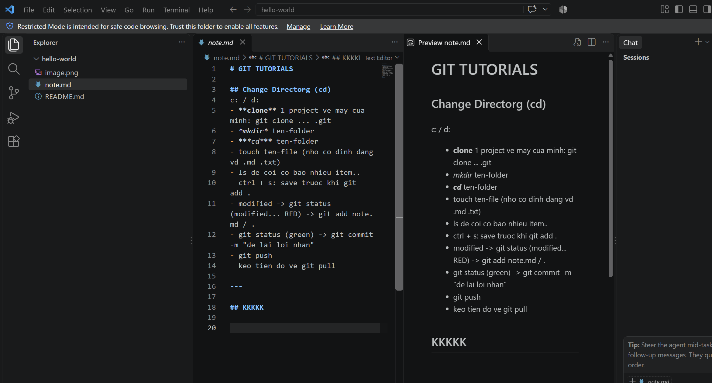

# GIT TUTORIALS

## Change Directorg (cd)
c: / d:
- **clone** 1 project ve may cua minh: git clone ... .git
- *mkdir* ten-folder
- ***cd*** ten-folder
- touch ten-file (nho co dinh dang vd .md .txt)
- ls de coi co bao nhieu item..
- ctrl + s: save truoc khi git add .
- modified -> git status (modified... RED) -> git add note.md / .
- git status (green) -> git commit -m "de lai loi nhan"
- git push
- keo tien do ve git pull

$\begin{bmatrix} 1 & 3 \\ 2 & 4 \end{bmatrix} $
$a_1$

---

## KKKKK

